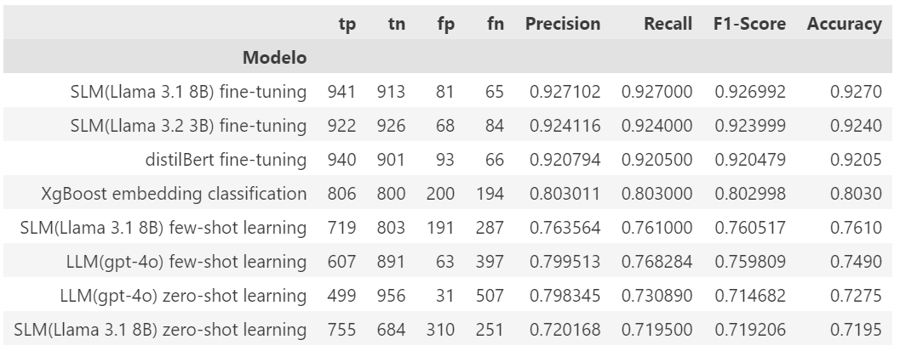

**Suicide Intent Detection: NLP Model Comparison**

This project compares several approaches for detecting suicidal intentions in online text. It evaluates the effectiveness and efficiency of different models in the context of suicide intent detection, utilizing techniques like zero-shot, few-shot, and fine-tuning.

**Training Dataset**

The dataset consists of comments from several sources translated to Spanish language and classified as suicidal ideation/behavior and non-suicidal.
[source PrevenIA/spanish-suicide-intent](https://huggingface.co/datasets/PrevenIA/spanish-suicide-intent)
  

The following four approaches are implemented and compared in this project:

* **XGBoost with BERT Embeddings**
  
Tokenizes and creates text embeddings using BERT to feed into an XGBoost model for classification.

* **Large Language Model (LLM): ChatGPT-4o**
  
Utilizes ChatGPT-4 with zero-shot and few-shot learning to detect suicide intent based on online text.

* **LLaMA Models (LLaMA 3.1 8B and LLaMA 3.2 3B)**
  
Compares versions of LLaMA models, using zero-shot, few-shot, and fine-tuning techniques to enhance performance.

* **DistilBERT**
  
A smaller, more efficient version of BERT. Fine-tuning is applied to tailor the model for the specific task of suicide intent detection.

1. [XGBoost with BERT Embeddings](ml_clasical_v1.ipynb)
2. [Large Language Model (LLM): ChatGPT-4o zero-shot and few-shot](test_model_gpt4.ipynb)
3. [SLM Model (LLaMA 3.1 8B) zero-shot and few-shot](Llama_3_1_zero_few_shot.ipynb)
4. [SLM Model (LLaMA 3.1 8B) fine-tuning](Fine_tuning_Llama_3_1_v3.ipynb)
5. [SLM Model (LLaMA 3.2 3B) fine-tuning](Fine_tuning_Llama_3_2_v2.ipynb)
6. [DistilBERT fine-tuning](Fine_tune_bert.ipynb)

* **Metrics Summary**

* 
